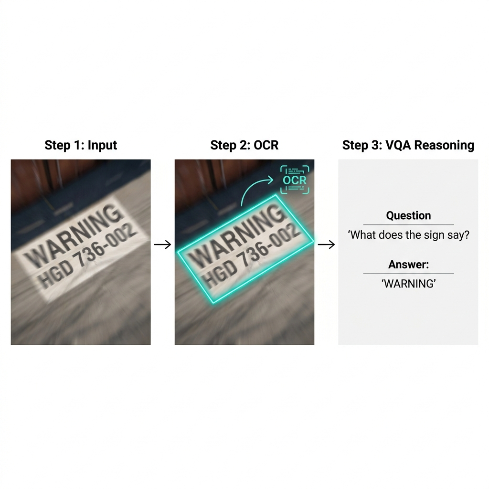

# Text-Centric Visual Question Answering Under Visual Degradation

> **A Comparative Study of Modular and End-to-End Approaches**



---

## Abstract

Text-centric Visual Question Answering (VQA) answers natural language queries by reading and reasoning over text in visual content. In real-world settings, visual degradation introduces uncertainty in optical character recognition (OCR) and downstream reasoning. This paper presents an empirical comparison of modular OCR-based pipelines and an end-to-end vision-language model under degraded visual conditions, using **4,013 images** with **7,000 question-answer pairs**.

Results show fine-tuned modular pipelines achieve up to **57.50% exact-match accuracy** versus 38.00% for the end-to-end baseline. Critically, our analysis reveals that conventional OCR error metrics (CER, WER) do not have a straightforward relationship with downstream VQA performance.

---

## Project Structure

```
├── models/                     # Model architecture and pipeline code
│   ├── sadbnet/                # SA-DBNet: Self-Attention Enhanced Text Detection
│   ├── trocr/                  # TrOCR fine-tuning configurations
│   ├── paddleocr/              # PaddleOCR curriculum training configs
│   ├── ocr_pipeline.py         # Core OCR pipeline implementation
│   ├── ablation_detection.py   # Detection ablation experiments
│   └── detection_vs_recognition.py
│
├── evaluation/                 # Evaluation scripts
│   ├── eval_both_pipelines.py  # Main evaluation: PaddleOCR vs SA-DBNet+TrOCR
│   ├── eval_paddleocr.py       # PaddleOCR baseline evaluation
│   ├── eval_paddleocr_finetuned.py
│   ├── eval_easyocr_trocr.py   # EasyOCR+TrOCR baseline evaluation
│   ├── eval_easyocr_trocr_finetuned.py
│   ├── eval_single_process.py  # Single-sample evaluation
│   ├── eval_single_process_easyocr.py
│   └── eval_ceiling_analysis.py
│
├── 📁 training/                     ← Training scripts + notebooks
│   ├── fine_tune_paddleocr_blur.py  ← PaddleOCR blur fine-tuning
│   ├── train_textzoom.py            ← TextZoom dataset training
│   └── notebooks/
│       ├── ablation_study.ipynb
│       ├── easyocr_evaluation.ipynb
│       ├── paddleocr_ablation.ipynb
│       └── pretrained-baseline-eval.ipynb
│
├── data/                       # Dataset placeholder (see Dataset section below)
│
├── diagrams/                   # Architecture diagrams
│   ├── fig2_sadbnet_pipeline.png
│   ├── fig3_paddleocr_pipeline.png
│   └── ...
│
├── paper/                      # Published paper
│   └── vqa_IJCNN_paper.pdf
│
├── 📁 results/                      ← Experiment logs and results
│   ├── evaluation_results_moderate_blur.json
│   ├── ablation_study_log.txt
│   └── benchmark_evaluation_log.txt   ← 605 KB of raw benchmark output
│
├── utils/                      # Utility scripts
│   ├── blur_paragraph_demo.py
│   ├── compare_models.py
│   ├── visualize_blur_levels.py
│   └── ...
│
├── docs/                       # Documentation
│   ├── ARCHITECTURE_DOCUMENTATION.md
│   ├── ABLATION_STUDY_EXPLAINED.md
│   ├── VLM_TRAINING_WORKFLOW.md
│   ├── KAGGLE_2xT4_TRAINING.md
│   └── DATASET_INSTRUCTIONS.md
│
├── requirements_venv.txt       # Python dependencies
└── README.md
```

---

## System Architecture

We evaluate two modular OCR-assisted pipelines and one end-to-end baseline:

### Pipeline 1: SA-DBNet + TrOCR + Qwen2-VL-2B (Proposed)


| Stage | Component | Details |
|-------|-----------|---------|
| **Detection** | SA-DBNet | ResNet-18 backbone + Self-Attention bottleneck + DCN-v2 FPN + DB Head |
| **Recognition** | TrOCR | DeiT-base ViT encoder + Autoregressive language decoder (fine-tuned) |
| **Reasoning** | Qwen2-VL-2B | 4-bit quantized, Flash Attention 2 |

### Pipeline 2: PaddleOCR + Qwen2-VL-2B (Baseline)


| Stage | Component | Details |
|-------|-----------|---------|
| **Detection** | DB++ | MobileNetV3 backbone + DBFPN |
| **Recognition** | SVTR (PP-OCRv4) | PPLCNetV3 + curriculum-trained (fine-tuned) |
| **Reasoning** | Qwen2-VL-2B | 4-bit quantized, Flash Attention 2 |

### Pipeline 3: End-to-End Baseline

| Stage | Component | Details |
|-------|-----------|---------|
| **Full Pipeline** | Qwen2-VL-2B | Direct image+question → answer (no explicit OCR) |

---

## Key Results

### Main Performance Comparison (Blur σ=5.0, n=7,000)

| Pipeline | Accuracy (%) | ANLS | Semantic Sim. | CER | FPS |
|----------|:---:|:---:|:---:|:---:|:---:|
| **SA-DBNet+TrOCR+Qwen (FT)** | **57.50** | 0.54 | 0.50 | 0.46 | 0.59 |
| PaddleOCR+Qwen (FT) | 42.83 | **0.59** | 0.61 | **0.42** | 0.72 |
| Qwen2-VL (End-to-End) | 38.00 | 0.57 | **0.65** | 0.58 | **0.76** |

### Impact of Fine-Tuning

| Pipeline | Pretrained | Fine-tuned | Gain |
|----------|:---:|:---:|:---:|
| PaddleOCR+Qwen | 32.50% | 42.83% | +10.33% |
| **SA-DBNet+TrOCR+Qwen** | 28.00% | **57.50%** | **+29.50%** |

---

## Novel SA-DBNet Architecture (Developed by Our Team)

To address the challenges of text detection under severe visual degradation, **our team designed and developed SA-DBNet** (Self-Attention Enhanced Differentiable Binarization Network). We built upon the foundational DBNet framework by engineering two major architectural innovations:

1. **Self-Attention Spatial Bottleneck** — We injected a custom global self-attention module at the deepest backbone feature level (1/32-scale). This computes spatial attention with a learnable scaling parameter γ, allowing the network to perform long-range contextual reasoning to infer text structure even when heavily blurred.

2. **Deformable Convolutions (DCN-v2)** — We applied dynamic deformable convolutions at every FPN lateral output level. This allows the network to learn data-dependent spatial offsets, dynamically adapting its receptive field to capture perspective-skewed and heavily distorted text.

3. **Differentiable Binarization** — Produces probability map P, threshold map T, and binary map B = 1/(1 + e^(-k(P-T))) with k=50.

**Training:** AdamW optimizer with gradient clipping. Pre-trained on TextVQA pseudo-labels (21,953 images), fine-tuned on ICDAR 2015 (1,000 images) at 640×640 resolution. Achieves **F1-score of 59%** on the detection benchmark.

---

## Dataset

The evaluation benchmark consists of **4,013 images** with **7,000 question-answer pairs** covering:
- Header-level queries (prominent textual cues)
- Detail-level queries (fine-grained/numerical text)
- Spatial reasoning queries (relative arrangement of text)

Visual degradation is applied using Gaussian blur (σ=5.0) to simulate motion blur and defocus.

**Dataset available on Kaggle:**
[VQA Dataset](https://www.kaggle.com/datasets/kagglemodeltraining/vqa-dataset)

---

## Installation

```bash
# Clone the repository
git clone https://github.com/RitaliVatsi/ocr_project.git
cd ocr_project

# Install dependencies
pip install -r requirements_venv.txt

# Additional dependencies for specific pipelines:
# PaddleOCR: pip install paddleocr paddlepaddle-gpu
# TrOCR: pip install transformers peft
# Qwen2-VL: pip install qwen-vl-utils bitsandbytes
```


---

## Hardware Requirements

- **GPU:** NVIDIA GPU with ≥8GB VRAM (tested on T4, A100)
- **RAM:** ≥16GB
- **Storage:** ≥10GB for models and dataset

All experiments use 4-bit quantization for the Qwen2-VL model to reduce memory requirements.


---

## License

This project is released under the [MIT License](LICENSE).

---

## Acknowledgements

- [TextVQA](https://textvqa.org/) — Base dataset for VQA evaluation and blur synthesis
- [Qwen2-VL](https://github.com/QwenLM/Qwen-VL) — Vision-Language Model
- [TrOCR](https://github.com/microsoft/unilm/tree/master/trocr) — Transformer-based OCR
- [PaddleOCR](https://github.com/PaddlePaddle/PaddleOCR) — Practical OCR tools
- [DBNet](https://github.com/MhLiao/DB) — Differentiable Binarization
