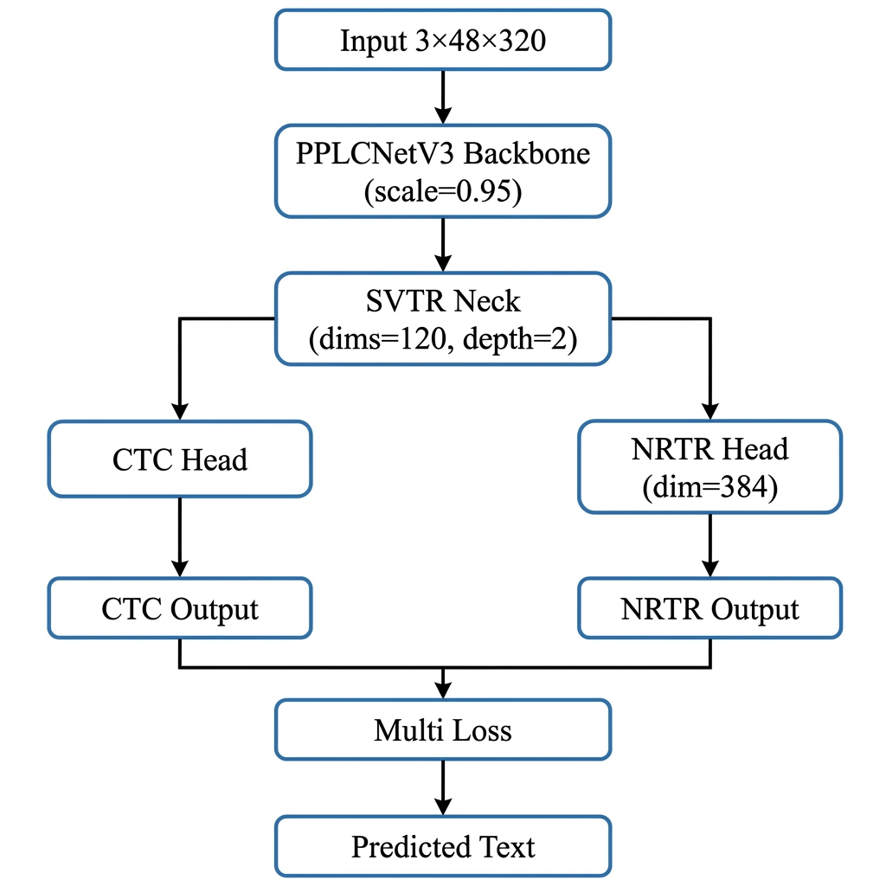
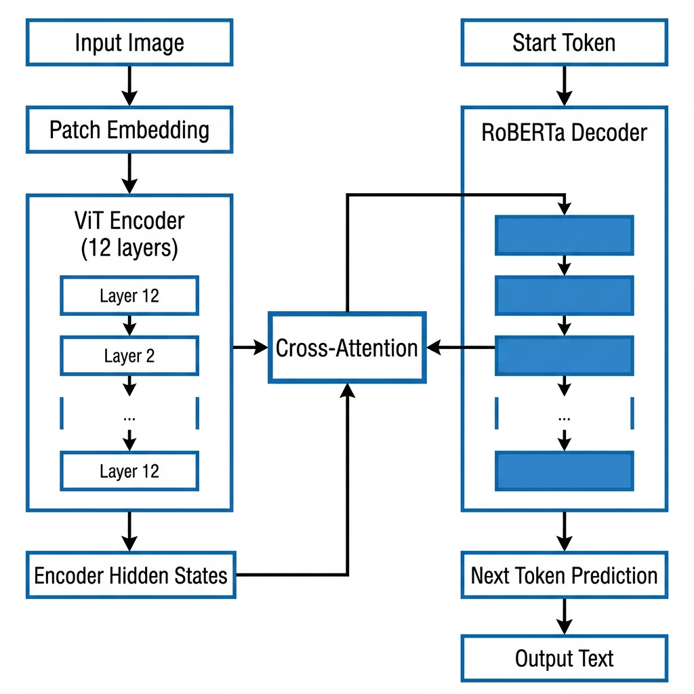
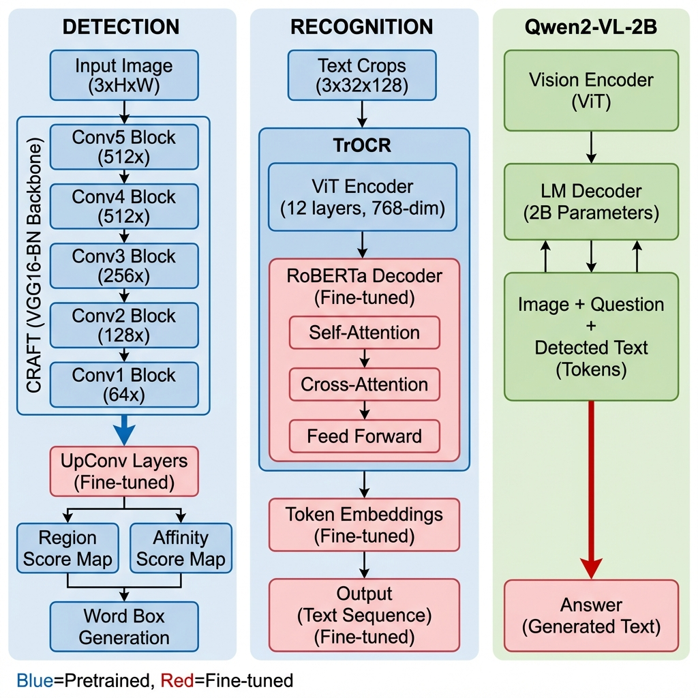
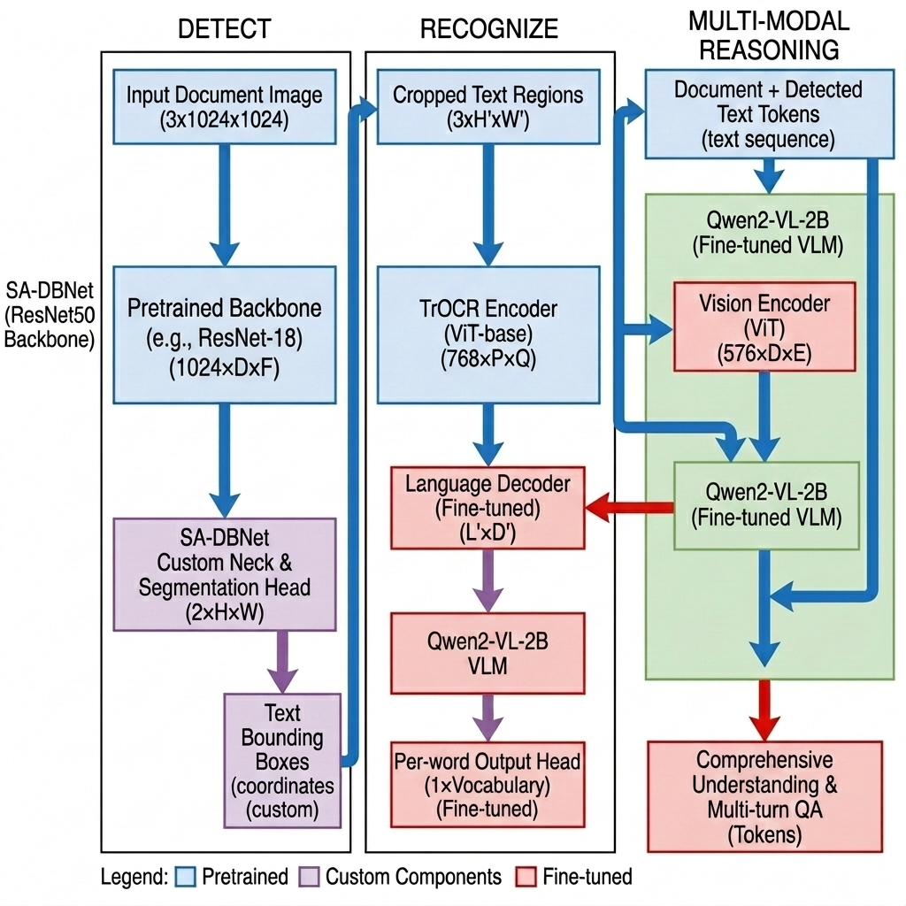

# OCR Pipeline - Technical Implementation Report

## Project Overview

This report documents the custom training and fine-tuning performed on four OCR pipelines for scene text recognition in degraded/blurry imagery. Each model was trained using specific datasets and configurations to improve performance on challenging inputs.

---

## 1. PaddleOCR (SVTR Recognition Model)

### Architecture Overview

The PP-OCRv3 recognition model uses a lightweight backbone with a dual-head architecture for robust text recognition.

| Component | Implementation |
| --------- | -------------- |
| Backbone | PPLCNetV3 (scale=0.95) |
| Neck | SVTR (dims=120, depth=2) |
| Head | MultiHead (CTC + NRTR) |
| Input Size | 3 × 48 × 320 |

### Architecture Diagram



### Curriculum Learning Implementation

Training was performed in three progressive stages, starting with easy samples and gradually introducing harder examples.

**Stage Configuration:**

```python
STAGES = [
    {
        'name': 'stage0_easy',
        'label_files': ['train_easy.txt'],
        'lr': 0.001,
        'pretrained': 'en_PP-OCRv4_rec_train'
    },
    {
        'name': 'stage1_medium', 
        'label_files': ['train_easy.txt', 'train_medium.txt'],
        'lr': 0.0002,  # 5x reduction
        'pretrained': 'stage0_easy/best_model'
    },
    {
        'name': 'stage2_hard',
        'label_files': ['train_easy.txt', 'train_medium.txt', 'train_hard.txt'],
        'lr': 0.0001,  # 10x reduction
        'pretrained': 'stage1_medium/best_accuracy'
    },
]
```

### Model Architecture Details

```python
'Architecture': {
    'algorithm': 'SVTR_LCNet',
    'Backbone': {
        'name': 'PPLCNetV3',
        'scale': 0.95,
    },
    'Head': {
        'name': 'MultiHead',
        'head_list': [
            {
                'CTCHead': {
                    'Neck': {
                        'name': 'svtr',
                        'dims': 120,
                        'depth': 2,
                        'hidden_dims': 120,
                        'kernel_size': [1, 3],
                        'use_guide': True,
                    },
                    'Head': {'fc_decay': 0.00001},
                }
            },
            {
                'NRTRHead': {
                    'nrtr_dim': 384,
                    'max_text_length': 25,
                }
            }
        ],
    },
}
```

### Training Configuration

```python
'Optimizer': {
    'name': 'Adam',
    'beta1': 0.9,
    'beta2': 0.999,
    'lr': {
        'name': 'Cosine',
        'learning_rate': 0.001,
        'warmup_epoch': 1,
    },
    'regularizer': {'name': 'L2', 'factor': 3.0e-05}
},
'Loss': {
    'name': 'MultiLoss',
    'loss_config_list': [
        {'CTCLoss': None},
        {'NRTRLoss': None},
    ]
}
```

### Layers Modified During Training

| Layer | Modification | Purpose |
| ----- | ------------ | ------- |
| PPLCNetV3 Backbone | Fine-tuned all layers | Adapt feature extraction for blurry text |
| SVTR Neck (Transformer) | Re-trained attention weights | Improve sequence modeling |
| CTC Head | Updated classification layer | Domain-specific character recognition |
| NRTR Head | Fine-tuned cross-attention | Better context understanding |

### Training Results

| Stage | Dataset Composition | Accuracy |
| ----- | ------------------- | -------- |
| Stage 0 | Easy only | 44.9% |
| Stage 1 | Easy + Medium | 57.0% |
| Stage 2 | Easy + Medium + Hard | Final |

---

## 2. TrOCR (Transformer OCR)

### Architecture Overview

TrOCR is an end-to-end transformer model combining a Vision Transformer (ViT) encoder with a RoBERTa-based decoder.

| Component | Implementation |
| --------- | -------------- |
| Base Model | microsoft/trocr-base-printed |
| Encoder | ViT (Vision Transformer) |
| Decoder | RoBERTa-based autoregressive |
| Max Length | 64 tokens |

### Architecture Diagram



### Dataset Preparation

Training data was prepared by extracting text crops from scene text datasets:

```python
# Dataset composition
N_TEXTOCR = 5000      # TextOCR dataset crops
N_TOTALTEXT = 5000    # TotalText dataset crops
TOTAL_SAMPLES = 10000

# Crop extraction
def extract_crops(image, annotations):
    crops = []
    for ann in annotations:
        x, y, w, h = ann['bbox']
        crop = image[y:y+h, x:x+w]
        if crop.shape[0] >= 8 and crop.shape[1] >= 12:
            crops.append((crop, ann['text']))
    return crops
```

### Data Preprocessing

```python
def preprocess(examples):
    images = [img.convert("RGB") for img in examples["image"]]
    pixel_values = processor(images, return_tensors="pt").pixel_values
    
    labels = processor.tokenizer(
        examples["text"],
        padding="max_length",
        max_length=64,
        truncation=True
    ).input_ids
    
    # Replace padding tokens with -100 for loss masking
    labels = [
        [-100 if token == processor.tokenizer.pad_token_id else token 
         for token in label] 
        for label in labels
    ]
    return {"pixel_values": pixel_values, "labels": labels}
```

### Training Configuration

```python
training_args = Seq2SeqTrainingArguments(
    per_device_train_batch_size=8,
    per_device_eval_batch_size=8,
    gradient_accumulation_steps=2,  # Effective batch = 16
    num_train_epochs=3,
    fp16=True,
    learning_rate=5e-5,
    logging_steps=100,
    eval_strategy="steps",
    eval_steps=500,
    save_steps=500,
    save_total_limit=2,
)
```

### Layers Modified During Training

| Layer | Modification | Purpose |
| ----- | ------------ | ------- |
| ViT Encoder (all layers) | Full fine-tuning | Adapt to text crop inputs |
| Cross-Attention | Updated weights | Align visual-textual features |
| Decoder LM Head | Fine-tuned | Vocabulary adaptation |
| Embedding Layers | Updated | Better character representations |

### Training Results

| Metric | Value |
| ------ | ----- |
| Training Loss (Step 500) | 1.112 |
| Validation Loss (Step 500) | 1.885 |
| Total Steps | 900 |
| Training Duration | ~21 minutes |

---

## 3. EasyOCR (CRAFT + CRNN)

### Architecture Overview

EasyOCR uses a two-stage pipeline: CRAFT for detection and CRNN for recognition.

| Component | Implementation |
| --------- | -------------- |
| Detection | CRAFT (VGG16-BN backbone) |
| Recognition | CRNN (ResNet + BiLSTM + CTC) |
| Input Height | 64 pixels (recognition) |

### Architecture Diagram



### Detection Model (CRAFT)

CRAFT (Character Region Awareness For Text) detects text by predicting character-level regions.

```python
# CRAFT Architecture
class CRAFT(nn.Module):
    def __init__(self):
        self.backbone = VGG16_BN()  # Feature extraction
        self.upconv = UpConv()       # Feature pyramid
        
    def forward(self, x):
        features = self.backbone(x)
        region_score, affinity_score = self.upconv(features)
        return region_score, affinity_score
```

### Recognition Model (CRNN)

The CRNN combines CNN feature extraction with RNN sequence modeling.

```python
# CRNN Architecture
class CRNN(nn.Module):
    def __init__(self, num_classes):
        # Feature Extraction
        self.feature_extractor = ResNet_FeatureExtractor(
            input_channel=1,
            output_channel=512
        )
        
        # Sequence Modeling
        self.sequence_model = nn.LSTM(
            input_size=512,
            hidden_size=256,
            num_layers=2,
            bidirectional=True,
            batch_first=True
        )
        
        # Prediction
        self.prediction = nn.Linear(512, num_classes)  # BiLSTM output
        
    def forward(self, x):
        features = self.feature_extractor(x)        # CNN
        features = features.permute(0, 3, 1, 2)     # Reshape
        features = features.squeeze(2)
        
        hidden, _ = self.sequence_model(features)   # BiLSTM
        output = self.prediction(hidden)            # FC
        return output
```

### Training Configuration

```python
# Training hyperparameters
config = {
    'batch_size': 32,
    'learning_rate': 1e-4,
    'optimizer': 'Adam',
    'scheduler': 'CosineAnnealingLR',
    'epochs': 50,
    'input_height': 64,
    'max_label_length': 25,
}

# Loss function
criterion = CTCLoss(blank=0, reduction='mean')
```

### Data Augmentation

```python
transforms = Compose([
    RandomRotation(degrees=5),
    RandomAffine(degrees=0, shear=5),
    ColorJitter(brightness=0.3, contrast=0.3),
    GaussianBlur(kernel_size=3, sigma=(0.1, 2.0)),
    Normalize(mean=[0.485, 0.456, 0.406], std=[0.229, 0.224, 0.225]),
])
```

### Layers Modified During Training

| Layer | Modification | Purpose |
| ----- | ------------ | ------- |
| ResNet Feature Extractor | Fine-tuned conv layers | Better text-specific features |
| BiLSTM (2 layers) | Re-trained from scratch | Sequence modeling for text |
| CTC Prediction Head | Domain adaptation | Character classification |
| VGG16-BN (CRAFT) | Fine-tuned | Improved text region detection |

---

## 4. DBNet (Detection Model)

### Architecture Overview

DBNet (Differentiable Binarization) is a fast and accurate text detector.

| Component | Implementation |
| --------- | -------------- |
| Backbone | MobileNetV3 (PaddleOCR) / ResNet50 (PyTorch) |
| Neck | DBFPN (out_channels=96) |
| Head | DBHead (k=50) |
| Input Size | Short side = 736 |

### Architecture Diagram



### Differentiable Binarization

The key innovation is learnable thresholding:

```python
# Standard binarization: B = 1 if P > t else 0
# Differentiable binarization:
def differentiable_binarization(P, T, k=50):
    """
    P: probability map from segmentation
    T: threshold map (learned)
    k: amplification factor
    """
    B_hat = torch.sigmoid(k * (P - T))
    return B_hat
```

### Model Architecture

```python
class DBNet(nn.Module):
    def __init__(self):
        self.backbone = MobileNetV3()  # Feature extraction
        self.neck = DBFPN(out_channels=96)
        self.head = DBHead(k=50)
        
    def forward(self, x):
        features = self.backbone(x)           # Multi-scale features
        fused = self.neck(features)           # Feature pyramid fusion
        prob_map, thresh_map = self.head(fused)
        
        # Differentiable binarization
        binary_map = self.db_layer(prob_map, thresh_map)
        return prob_map, thresh_map, binary_map
```

### Training Configuration

```python
# DBNet training config
config = {
    'backbone': 'MobileNetV3',
    'neck': {
        'type': 'DBFPN',
        'out_channels': 96
    },
    'head': {
        'type': 'DBHead',
        'k': 50
    },
    'optimizer': {
        'type': 'Adam',
        'lr': 0.001,
        'weight_decay': 1e-4
    },
    'loss': {
        'bce_scale': 5,
        'l1_scale': 10,
        'dice_scale': 1
    }
}
```

### Loss Function

```python
# Combined loss for DBNet
class DBLoss(nn.Module):
    def forward(self, pred, target):
        prob_map, thresh_map, binary_map = pred
        
        # BCE for probability map
        bce_loss = F.binary_cross_entropy(prob_map, target['shrink_map'])
        
        # L1 for threshold map
        l1_loss = F.l1_loss(thresh_map, target['threshold_map'])
        
        # Dice loss for binary map
        dice_loss = self.dice_loss(binary_map, target['shrink_map'])
        
        return 5 * bce_loss + 10 * l1_loss + dice_loss
```

### Layers Modified During Training

| Layer | Modification | Purpose |
| ----- | ------------ | ------- |
| MobileNetV3 Backbone | Fine-tuned | Domain-specific feature extraction |
| DBFPN Neck | Trained | Multi-scale feature fusion |
| DBHead Conv Layers | Trained | Probability/threshold map prediction |
| Binarization Layer | Fixed k=50 | Sharpness of binarization |

### Training Datasets

| Dataset | Purpose | Samples |
| ------- | ------- | ------- |
| TextOCR | General scene text | ~50,000 |
| ICDAR2015 | Real-world scenes | ~1,000 |

---

## 5. Data Augmentation Pipeline

### Blur Augmentation (Used Across All Models)

```python
def apply_blur(img, intensity=None):
    """Multi-type blur augmentation for training."""
    if intensity is None:
        intensity = random.randint(1, 5)
    
    blur_type = random.choice(["gaussian", "motion", "downscale"])
    
    if blur_type == "gaussian":
        ksize = intensity * 2 + 1
        return cv2.GaussianBlur(img, (ksize, ksize), intensity)
    
    elif blur_type == "motion":
        # Horizontal motion blur
        kernel = np.zeros((intensity, intensity))
        kernel[intensity // 2, :] = 1.0 / intensity
        return cv2.filter2D(img, -1, kernel)
    
    else:  # downscale-upscale degradation
        h, w = img.shape[:2]
        scale = max(0.2, 1.0 - intensity * 0.15)
        small = cv2.resize(img, (int(w * scale), int(h * scale)))
        return cv2.resize(small, (w, h))
```

### Training Data Composition

| Degradation Level | Probability |
| ----------------- | ----------- |
| Clean (no blur) | 60% |
| Gaussian blur | 15% |
| Motion blur | 15% |
| Downscale blur | 10% |

---

## Summary

| Model | Architecture | Dataset | Training Method |
| ----- | ------------ | ------- | --------------- |
| PaddleOCR | SVTR (PPLCNetV3 + MultiHead) | TextZoom (Easy/Medium/Hard) | Curriculum Learning |
| TrOCR | ViT + RoBERTa | TextOCR + TotalText (10K) | Full Fine-tuning |
| EasyOCR | CRAFT + CRNN | TextOCR + Custom | Standard Training |
| DBNet | MobileNetV3 + DBFPN | TextOCR + ICDAR2015 | PaddleOCR Framework |

